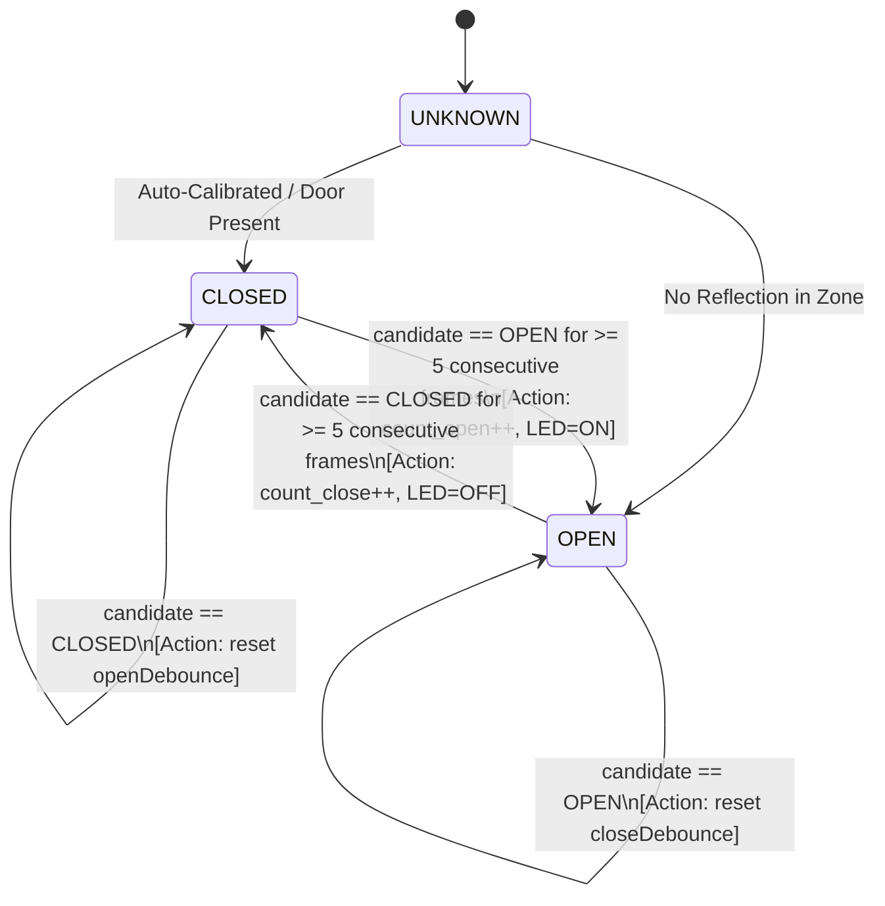

# Millimeter-Wave Radar Door Detection: Theory, Mathematics, and Algorithms

A comprehensive engineering guide covering the physical principles, signal processing chain, mathematical derivations, and algorithm architectures behind the **TI AWR1843BOOST Standalone Door Open/Close Detector and Cycle Counter**.

---

## Table of Contents
1. [Introduction to FMCW Radar](#1-introduction-to-fmcw-radar)
2. [Range Processing & Beat Frequency Derivation](#2-range-processing--beat-frequency-derivation)
3. [Doppler Processing & Motion Signatures](#3-doppler-processing--motion-signatures)
4. [Angle of Arrival (AoA) & MIMO Virtual Array](#4-angle-of-arrival-aoa--mimo-virtual-array)
5. [Target Detection via CFAR (Constant False Alarm Rate)](#5-target-detection-via-cfar-constant-false-alarm-rate)
6. [Door Detection Spatial Gating Algorithm](#6-door-detection-spatial-gating-algorithm)
7. [Finite State Machine (FSM) & Debounce Filtering](#7-finite-state-machine-fsm--debounce-filtering)
8. [Automated Baseline Calibration](#8-automated-baseline-calibration)
9. [On-Chip Embedded Architecture (Why DCA1000 is Not Needed)](#9-on-chip-embedded-architecture-why-dca1000-is-not-needed)

---

## 1. Introduction to FMCW Radar

Frequency Modulated Continuous Wave (**FMCW**) radar transmits periodic linear frequency sweeps known as **chirps**. Unlike optical sensors (which suffer in the dark or through dust) or ultrasonic sensors (which suffer from broad beamwidths, air temperature drift, and low angular resolution), 77 GHz mmWave radar provides high range resolution, micro-motion sensitivity, and penetration through non-metallic enclosures.

```
Frequency (GHz)
   ^
81 |                  /                  /
   |                 /                  /
   |                /                  /
   |     Bandwidth /                  /
   |        (B)   /                  /
77 |             /                  /
   +------------+----+-------------+----+--------> Time
                < Tc >
```

### Chirp Parameters
- **Start Frequency ($f_0$ / $f_c$)**: $77\text{ GHz}$
- **Chirp Duration ($T_c$)**: Active ramp time during which ADC samples are acquired
- **Chirp Slope ($S$)**: Rate of frequency increase: $S = \frac{df}{dt} = \frac{B}{T_c}$
- **Wavelength ($\lambda$)**: $\lambda = \frac{c}{f_c} = \frac{3 \times 10^8\text{ m/s}}{77 \times 10^9\text{ Hz}} \approx 3.896\text{ mm}$

---

## 2. Range Processing & Beat Frequency Derivation

### The Physics of Range Measurement
Consider a door located at radial distance $R$ from the sensor. The round-trip flight time of the electromagnetic wave is:

$$
\tau = \frac{2R}{c}
$$

where $c \approx 3 \times 10^8\text{ m/s}$ is the speed of light.

When the transmitted chirp bounces off the door and reaches the receiver, it is delayed by $\tau$. The received signal is mixed with the currently transmitted chirp in an analog mixer (quadrature demodulation), producing an **Intermediate Frequency (IF)** signal or **beat signal**:

```
Frequency ^
          |      Transmitted Chirp
          |     /
          |    /|    Received Chirp
          |   / |   /
          |  /  |  /
          | /   | /
          |/____|/______________
          0     tau            Time
                <->
              Delay
```

The frequency difference between transmitted and received signals is constant over the linear ramp:

$$
f_{\text{IF}} = S \cdot \tau = S \cdot \frac{2R}{c}
$$

Solving for distance $R$:

$$
R = \frac{c \cdot f_{\text{IF}}}{2S}
$$

### 1D Range FFT
The continuous IF signal is sampled by an onboard ADC at sampling frequency $F_s = 7200\text{ ksps}$ into $N_{\text{ADC}} = 256$ samples. Performing an FFT on this time-domain ADC buffer transforms the beat frequencies into a **Range Profile**:
- Every spectral peak in the Range FFT corresponds to a physical reflecting surface.
- The frequency spacing per FFT bin is:

$$
\Delta f = \frac{F_s}{N_{\text{ADC}}}
$$

- Substituting $\Delta f$ into the range equation yields the **Range Resolution ($\Delta R$)**:

$$
\Delta R = \frac{c \cdot \Delta f}{2S} = \frac{c \left(\frac{F_s}{N_{\text{ADC}}}\right)}{2 \left(\frac{B}{T_{\text{ADC}}}\right)}
$$

  Since $T_{\text{ADC}} = \frac{N_{\text{ADC}}}{F_s}$, the expression simplifies directly to:

$$
\Delta R = \frac{c}{2B}
$$

### Numerical Calculation for Our Door Sensor
In [door_sensor_profile.cfg](file:///C:/Users/dellb/Desktop/VISHNU/PROJECTS/DOOR%20SENSOR/config/door_sensor_profile.cfg):
- Chirp Slope: $S = 100\text{ MHz}/\mu\text{s} = 100 \times 10^{12}\text{ Hz/s}$
- ADC Samples: $N_{\text{ADC}} = 256$
- ADC Sampling Rate: $F_s = 7200\text{ ksps} = 7.2\times 10^6\text{ samples/s}$
- Active Collection Time: $T_{\text{ADC}} = \frac{256}{7.2 \times 10^6\text{ s}} \approx 35.56\,\mu\text{s}$
- Effective Swept Bandwidth:

$$
B = S \cdot T_{\text{ADC}} = 100 \times 10^{12} \times 35.56 \times 10^{-6} \approx 3.556\text{ GHz}
$$

- Resulting Range Resolution:

$$
\Delta R = \frac{3 \times 10^8\text{ m/s}}{2 \times 3.556 \times 10^9\text{ Hz}} \approx 0.0422\text{ m} = \mathbf{4.22\text{ cm}}
$$

With a **4.2 cm range resolution**, the radar easily detects even slight door openings (e.g. 5–10 cm cracks) by observing the collapse or shift of the closed-door reflection peak.

---

## 3. Doppler Processing & Motion Signatures

### Phase Sensitivity & Velocity
While the beat frequency $f_{\text{IF}}$ resolves coarse distance on the centimeter scale, the phase $\phi$ of the received IF signal is sensitive to sub-millimeter displacements. The phase of the beat signal is:

$$
\phi = 2\pi f_c \tau = 2\pi \frac{c}{\lambda} \left(\frac{2R}{c}\right) = \frac{4\pi R}{\lambda}
$$

If the door moves by a tiny displacement $\Delta R$:

$$
\Delta \phi = \frac{4\pi \Delta R}{\lambda}
$$

Since $\lambda \approx 3.9\text{ mm}$, a displacement of only **1 mm** produces a phase shift of:

$$
\Delta \phi = \frac{4\pi \times 0.001}{0.0039} \approx 3.22\text{ radians} \approx 184^\circ
$$

### 2D Doppler FFT
Across a frame of $N_{\text{chirps}} = 32$ consecutive chirps separated by inter-chirp interval $T_c$:

$$
\Delta R = v \cdot T_c \implies \Delta \phi = \frac{4\pi v T_c}{\lambda}
$$

Solving for radial velocity $v$:

$$
v = \frac{\lambda \cdot \Delta \phi}{4\pi T_c}
$$

Performing a second FFT across the chirps for each range bin (2D FFT) generates the **Range-Doppler Matrix**:
- **Door Opening**: Radial velocity is non-zero ($v > 0$ as the door leaf recedes from the sensor).
- **Door Closing**: Radial velocity reverses ($v < 0$ as the door leaf approaches the sensor).
- **Door Stationary (Closed or Held Open)**: Energy concentrates in the zero-Doppler bin ($v = 0$).

---

## 4. Angle of Arrival (AoA) & MIMO Virtual Array

### Spatial Phase Shift
To estimate the lateral position ($x$) and height ($z$) of reflections, the AWR1843 utilizes multiple receive antennas. When a reflected wave arrives at angle $\theta$ relative to boresight, it travels an extra path length $d \sin(\theta)$ to adjacent antenna elements:

```
Incident Wavefront
        \
         \
          \
-----------+-----------------+------ Antenna Plane
          RX1      d         RX2
                   <--------->
                             |
                             +-- Extra distance = d * sin(theta)
```

The phase difference between adjacent RX antennas spaced by distance $d = \frac{\lambda}{2}$ is:

$$
\Delta \Phi = \frac{2\pi}{\lambda} d \sin(\theta) = \frac{2\pi}{\lambda} \left(\frac{\lambda}{2}\right) \sin(\theta) = \pi \sin(\theta)
$$

Solving for arrival angle $\theta$:

$$
\theta = \arcsin\left(\frac{\Delta \Phi}{\pi}\right)
$$

### Time-Division Multiplexed (TDM) MIMO
The AWR1843 features **3 Transmit (TX)** antennas and **4 Receive (RX)** antennas. By alternating transmissions between TX1 and TX2 across consecutive chirps (TDM-MIMO), the system synthesizes a **virtual antenna array** of $2 \times 4 = 8$ elements in azimuth:
- **Azimuth Angular Resolution**:

$$
\Delta \theta \approx \frac{\lambda}{N_{\text{virtual}} \cdot d} = \frac{2}{8} \approx 0.25\text{ rad} \approx 14.3^\circ
$$

### Cartesian 3D Reconstruction
From measured spherical coordinates (range $R$, azimuth $\theta$, elevation $\phi$), the onboard processor calculates 3D Cartesian coordinates:

$$
\begin{cases} 
x = R \sin(\theta) \cos(\phi) & \text{(Lateral position)} \\ 
y = R \cos(\theta) \cos(\phi) & \text{(Boresight depth)} \\ 
z = R \sin(\phi) & \text{(Elevation)} 
\end{cases}
$$

---

## 5. Target Detection via CFAR (Constant False Alarm Rate)

Radar environments contain background noise, thermal noise, and static clutter. A fixed amplitude threshold either causes false detections (when noise increases) or misses small reflections (when threshold is set too high).

### Cell-Averaging CFAR (CA-CFAR)
CFAR dynamically computes an adaptive threshold for each **Cell Under Test (CUT)** by averaging the noise floor of surrounding **Training Cells**, while skipping immediate **Guard Cells** to avoid signal leakage:

```
[ Training Cells ] [ Guard ] [ CUT ] [ Guard ] [ Training Cells ]
<----- N/2 ----->  <-- G -->         <-- G -->  <----- N/2 ----->
```

1. **Noise Power Estimation ($P_n$)**:

$$
P_n = \frac{1}{N_{\text{train}}} \left(\sum_{i=1}^{N_{\text{train}}/2} X_{\text{left}}[i] + \sum_{i=1}^{N_{\text{train}}/2} X_{\text{right}}[i]\right)
$$

2. **Adaptive Detection Threshold ($V_{th}$)**:

$$
V_{th} = \alpha \cdot P_n
$$

where $\alpha$ is a scaling factor related to the desired probability of false alarm ($P_{\text{FA}}$):

$$
\alpha = N_{\text{train}} \left(P_{\text{FA}}^{-1 / N_{\text{train}}} - 1\right)
$$

3. **Detection Decision**:

$$
\text{Target Present} \iff X_{\text{CUT}} > V_{th}
$$

For our door sensor:
- Static clutter removal is intentionally **disabled** (`clutterRemoval -1 0`) so that stationary doors remain detectable by CFAR.
- The CFAR SNR threshold is tuned to $15.0\text{ dB}$ (`cfarCfg -1 0 2 8 4 3 0 15.0 0`) to detect door reflections with near-zero false alarms.

---

## 6. Door Detection Spatial Gating Algorithm

After CFAR detection, the radar produces a 3D point cloud of $K$ points per frame:

$$
\mathcal{P} = \left\{ (x_i, y_i, z_i, v_i, \text{SNR}_i) \right\}_{i=1}^K
$$

### Region of Interest (ROI) Gating
A physical doorway occupies a defined volume in space. The spatial gating filter evaluates whether each point falls inside the 3D bounding box:

$$
\mathcal{B}_{\text{door}} = \left\{ (x, y, z) \;\middle|\; x_{\min} \le x \le x_{\max},\; R_{\min} \le y \le R_{\max},\; z_{\min} \le z \le z_{\max} \right\}
$$

Points outside this box (e.g. walls, ceiling, objects deeper in the room) are rejected:

$$
\mathcal{P}_{\text{door}} = \left\{ p \in \mathcal{P} \;\middle|\; p \in \mathcal{B}_{\text{door}} \right\}
$$

### Frame Metrics
On each frame $k$, three metrics are computed:

- **Point Count** $N_{\text{pts}}(k)$:

$$
N_{\text{pts}}(k) = |\mathcal{P}_{\text{door}}|
$$

- **Mean Range** $\bar{R}(k)$:

$$
\bar{R}(k) = \frac{1}{N_{\text{pts}}(k)} \sum_{p \in \mathcal{P}_{\text{door}}} \sqrt{x_p^2 + y_p^2 + z_p^2}
$$

- **Peak SNR** $\text{SNR}_{\text{peak}}(k)$:

$$
\text{SNR}_{\text{peak}}(k) = \max_{p \in \mathcal{P}_{\text{door}}} (\text{SNR}_p)
$$

### Instantaneous Candidate Decision
The instantaneous state candidate for frame $k$ is determined by comparing the point count and peak reflection energy against configured thresholds:

$$
\text{State}_{\text{cand}}(k) = \begin{cases} 
\text{CLOSED}, & \text{if } N_{\text{pts}}(k) \ge N_{\min} \text{ and } \text{SNR}_{\text{peak}}(k) \ge \text{SNR}_{\text{th}} \\ 
\text{OPEN}, & \text{otherwise} 
\end{cases}
$$

---

## 7. Finite State Machine (FSM) & Debounce Filtering

Physical environments experience transient disturbances: air currents swaying lightweight curtains, momentary RF multipath interference, or people walking outside the doorway. A raw per-frame decision would result in false transitions.

To guarantee zero false counts, the detector implements a **Hysteresis Debounced Finite State Machine**:



### Mathematical Formulation of Debouncing
Let $C_{\text{open}}(k)$ and $C_{\text{close}}(k)$ be consecutive-frame debounce accumulators.

**Transition from CLOSED to OPEN**:

$$
C_{\text{open}}(k) = \begin{cases} 
C_{\text{open}}(k-1) + 1, & \text{if } \text{State}_{\text{cand}}(k) = \text{OPEN} \\ 
0, & \text{if } \text{State}_{\text{cand}}(k) = \text{CLOSED} 
\end{cases}
$$

$$
\text{State}(k) = \begin{cases} 
\text{OPEN}, & \text{if } C_{\text{open}}(k) \ge M_{\text{open}} \implies \text{OpenCount} \leftarrow \text{OpenCount} + 1 \\ 
\text{CLOSED}, & \text{otherwise} 
\end{cases}
$$

**Transition from OPEN to CLOSED**:

$$
C_{\text{close}}(k) = \begin{cases} 
C_{\text{close}}(k-1) + 1, & \text{if } \text{State}_{\text{cand}}(k) = \text{CLOSED} \\ 
0, & \text{if } \text{State}_{\text{cand}}(k) = \text{OPEN} 
\end{cases}
$$

$$
\text{State}(k) = \begin{cases} 
\text{CLOSED}, & \text{if } C_{\text{close}}(k) \ge M_{\text{close}} \implies \text{CloseCount} \leftarrow \text{CloseCount} + 1 \\ 
\text{OPEN}, & \text{otherwise} 
\end{cases}
$$

### Temporal Analysis
With frame periodicity $T_{\text{frame}} = 100\text{ ms}$ (10 frames/sec) and debounce parameter $M = 5$:

$$
T_{\text{debounce}} = M \times T_{\text{frame}} = 5 \times 100\text{ ms} = \mathbf{500\text{ ms}}
$$

- Any transient reflection drop lasting less than $0.5\text{ s}$ is rejected as noise.
- When an intentional door opening or closing occurs, the transition triggers within exactly $500\text{ ms}$, ensuring responsive yet stable operation.

---

## 8. Automated Baseline Calibration

Because installation distances vary (e.g. wall mounting at 1.1m vs ceiling mounting at 0.8m), hardcoding fixed distance limits would require manual reconfiguration for every door.

The auto-calibration algorithm runs on power-up:
1. For the first $K_{\text{calib}} = 20$ frames ($\approx 2.0\text{ s}$), the user ensures the door is closed.
2. The MCU computes the sample mean of the closed door distance:

$$
\hat{R}_{\text{door}} = \frac{1}{K_{\text{calib}}} \sum_{j=1}^{K_{\text{calib}}} \bar{R}(j)
$$

3. The spatial range gate is automatically adapted around the measured door reflection:

$$
\begin{cases} 
R_{\min} = \max\left(0.15\text{ m},\; \hat{R}_{\text{door}} - 0.30\text{ m}\right) \\ 
R_{\max} = \hat{R}_{\text{door}} + 0.35\text{ m} 
\end{cases}
$$

4. Calibration completes, initial state is locked to `DOOR_STATE_CLOSED`, and normal FSM monitoring commences.

---

## 9. On-Chip Embedded Architecture (Why DCA1000 is Not Needed)

### What is the DCA1000?
The TI DCA1000 is a dedicated FPGA-based data capture card. Its sole purpose is streaming **raw, uncompressed ADC IQ time-domain samples** over LVDS lanes via high-speed Ethernet (1 Gbps) to a PC for offline algorithm development (e.g. in MATLAB or Python).

```
[Radar Front-End] ---> [ADC] ===(LVDS 600 Mbps)===> [DCA1000 FPGA] ===(Ethernet)===> [Host PC]
                                                    (Bulky, expensive, not standalone)
```

### Standalone On-Chip Architecture
The **AWR1843** is a complete SoC (System-on-Chip) integrating:
1. **BSS (Built-in Radar Subsystem)**: Autonomous 77 GHz RF transceiver, frequency synthesizer, and chirp engine.
2. **HWA (Hardware Accelerator)**: Computes 1D Range FFTs directly in silicon hardware without consuming CPU cycles.
3. **C674x DSP Core (600 MHz)**: Computes 2D Doppler FFTs, CFAR thresholding, azimuth/elevation angle estimation, and generates the 3D point cloud.
4. **ARM Cortex-R4F MCU (200 MHz)**: Runs SYS/BIOS RTOS, manages the radar datapath, executes the spatial gating and door FSM algorithm, controls onboard GPIOs/LEDs, and handles serial telemetry.

```
+------------------------------------------------------------------------------------+
|                                    AWR1843 SoC                                     |
|                                                                                    |
|  [3 TX / 4 RX Antennas]                                                            |
|          |                                                                         |
|          v                                                                         |
|  [BSS RF Transceiver] ---> [ADC Buffers]                                           |
|                                   |                                                |
|                                   v                                                |
|                        [Hardware Accelerator (HWA)]                                |
|                        - Windowing & 1D Range FFT                                  |
|                                   |                                                |
|                                   v                                                |
|                        [C674x DSP @ 600 MHz]                                       |
|                        - 2D Doppler FFT                                            |
|                        - CA-CFAR Detection                                         |
|                        - Angle of Arrival (AoA) Estimation                         |
|                                   |                                                |
|                                   v (Point Cloud: x, y, z, v, SNR)                 |
|                        [ARM Cortex-R4F @ 200 MHz]                                  |
|                        - door_detector.c (Spatial Gating & FSM)                    |
|                        - Cumulative Open/Close Cycle Counters                      |
|                        - GPIO_write (LED DS3: OFF=Closed, ON=Open)                 |
|                        - UART Telemetry & Custom CLI Commands                      |
+------------------------------------------------------------------------------------+
```

Because every processing step from raw RF chirps to the final open/close decision is executed entirely within the on-chip DSP and MCU, **the system is 100% self-contained**. It boots directly from onboard QSPI flash and operates continuously using any standard 5V power source.
